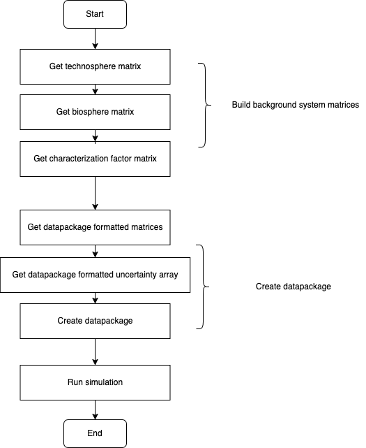
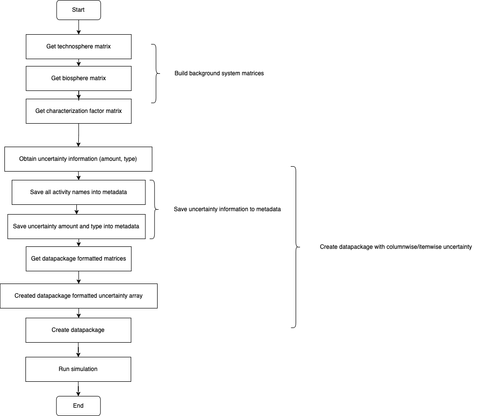

`Bamboo` is a Python package designed to import external databases with Brightway 2.5 framework, and assist you to model different types of uncertainty analysis or scenario analysis with datapackage matrix data.

## Dependencies
The dependencies needed for this library, is listed in `requirements.txt`, to install:
```
python install -r requirements.txt
```

## Illustration of uncertainty analysis
1) Process of add uncertainty uniformly  
  

2) Process of add uncertainty ununiformly  
  

## Getting Started
- [Import external database](https://github.com/Annedrew/brightway-bamboo/blob/main/notebooks/lca_with_foreground.ipynb)
- [LCA with Brightway 2.5](https://github.com/Annedrew/brightway-bamboo/blob/main/notebooks/lca_with_background.ipynb)
- [Uncertainty analysis](https://github.com/Annedrew/brightway-bamboo/blob/main/notebooks/uncertainty_analysis.ipynb)
