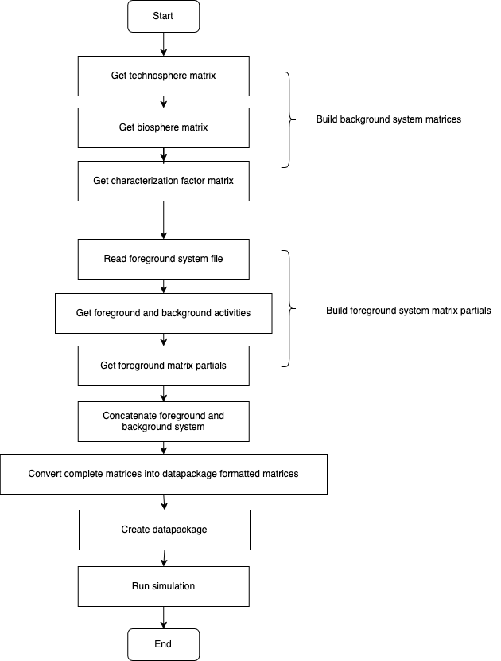

## Bamboo
`Bamboo` is a Python package designed to import external input-output databases, such as EXIOBASE with Brightway 2.5 framework, and assist you to model different types of uncertainty analysis or scenario analysis with datapackage matrix data.

## Dependencies
The dependencies needed for this library, is listed in `requirements.txt`, to install:
```
python install -r requirements.txt
```


## Getting Started
- [LCA with imported external database](https://github.com/Annedrew/brightway-bamboo/blob/main/notebooks/lca_with_foreground.ipynb)
- [LCA with background database](https://github.com/Annedrew/brightway-bamboo/blob/main/notebooks/lca_with_background.ipynb)
- [Uncertainty analysis](https://github.com/Annedrew/brightway-bamboo/blob/main/notebooks/uncertainty_analysis.ipynb)


## Illustration of importing foreground


## Illustration of uncertainty analysis
| Process of add uncertainty uniformly | Process of add uncertainty ununiformly |
|-------------------------------------------------|--------------------------------------------------|
|  |  |
