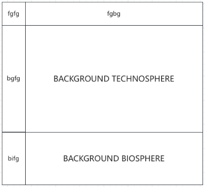

# BAMBOO

[](https://www.python.org/)
[](https://jupyter.org/)
[](https://github.com/Annedrew/bamboo/blob/main/LICENSE)

This is a Python package designed to import external input-output databases to brightway, such as EXIOBASE. In addition, it can assist you to model different types of uncertainty analysis or scenario analysis with datapackage matrix data.  

This library is developed based on **[Brightway2.5](https://docs.brightway.dev/en/latest/)** and **[EXIOBASE3](https://www.exiobase.eu/index.php/9-blog/31-now-available-exiobase2)** dataset.

## 📖 Background Knowledge 

### EXIOBASE
[EXIOBASE](https://www.exiobase.eu/) is a global, detailed Multi-Regional Environmentally Extended Supply-Use Table (MR-SUT) and Input-Output Table (MR-IOT). It can be used to do Life Cycle Assessment(LCA) analysis. The inventory data and emission data is stored in `txt` file. 

[EXIOBASE3](https://zenodo.org/records/3583071) is one of the most extensive EE-MRIO systems available worldwide. EXIOBASE 3 builds upon the previous versions of EXIOBASE by using rectangular supply‐use tables (SUT) in a 163 industry by 200 products classification as the main building blocks.

### Formula

$g = B (I-A)^{-1} f$. 

Where:
- B: Biosphere matrix
- A: Technospere matrix
- I: Identity matrix
- $f$: Functional unit

## ✨ Features
- Perform LCA based on input-output databases (such as EXIOBASE), using Brightway.
  - Perform LCA with only background database, or combined with a customizable foreground.
    - The matrix is ​​arranged like this:  
    The foreground system is constructed from four matrices: `fgbg`, `fgfg`, `bgfg`, and `bifg`. These matrices are named to reflect their row and column positions. Specifically:
      - `fgbg`: This is the matrix locate the foreground row first, then the background column. It indicates the amount of exchange that takes from background to foreground. Normally, there is no such exchange. So, by default this matrix is all zero.
      - `fgfg`: This is the matrix locate the foreground row first, then the foreground column. It indicates the amount of exchange that takes from foreground to foreground.
      - `bgfg`: This is the matrix locate the background row first, then the foreground column. It indicates the amount of exchange that takes from foreground to background.
      - `bifg`: This is the matrix locate the biosphere emission row first, then the foreground column. It indicates the amount of exchange that takes from foreground to biosphere.
    
- Uncertainty Analysis for input-output databases.
  - `uniformly`: This strategy add the same type/value of the uncertainty to a matrix, but you can add uncertainty for all matricies or only one/two of the matrices.
  - `columnwise`: This strategy add the same type/value of the uncertainty to the same column of a matrix, different column can have different type/value of uncertainty. To use this stragety, your uncertainty input should be defined in the file.
  - `itemwise`: This strategy add different type/value of the uncertainty different element in the matrix. To use this stragety, your uncertainty input should be defined in the file.

  **NOTICE:**  
    - Supported uncertainty type: 0, 1, 2, 3, 4 (Check [here](https://stats-arrays.readthedocs.io/en/latest/#mapping-parameter-array-columns-to-uncertainty-distributions) to select your uncertainty type.)
    - For strategy 2) and 3), only technosphere and biosphere matrices are supported.
    - `itemwise` recommends apply only to the foreground system, considering the amount of data that introduces uncertainty for both systems. The library does not specifically handle this situation.

## 👩‍💻 Getting Started
### Requirements
- This library was developed using **Python 3.12.9**.

### Dependencies

- To use this library, you have to have **Brightway2.5** installed. (To install Brightway, click [here](https://docs.brightway.dev/en/latest/content/installation/)).
- If you need to find the characterization factors through Brightway, then you need to have ecoinvent imported, otherwise, it is not necessary.
  - If you have ecoinvent license:
    ```
    bi.import_ecoinvent_release(
      version='<ecoinvent version>',
      system_model='consequential',
      username ='XXX', # use your own
      password='XXX' # use your own
    )
    ```
  - If you don't have ecoinvent license:
    - You can import one of the biosphere data:
      - `ecoinvent-3.10-biosphere`
      - `ecoinvent-3.8-biosphere`
      - `ecoinvent-3.9.1-biosphere`
      - `forwast`
      - `USEEIO-1.1`
    ```
    bi.remote.install_project('ecoinvent-3.10-biosphere', 'bamboo', overwrite_existing=True)
    ```

### Installation
1. Open your local terminal.  
(For windows, search for "Terminal/Prompt/PowerShell"; for macOS, search for "Terminal")

2. Install the library.
   ```
   pip install bamboo_lca
   ```

### Required files
(The examples of those file is in [data](notebooks/data) folder.)
- **External database file**: This is the file of your background database, for example the `A.txt` and `S.txt` for EXIOBASE.
- **Foreground system file**: This is the file for your foreground database, you need to prepare yourself. 
  - Reference examples: 
    - [foreground_system_1.csv](notebooks/data/foreground_system_1.csv)
    - [foreground_system_2.csv](notebooks/data/foreground_system_2.csv). 
  - Below shows the purpose of each column. You only need to change the data instead of the column names and order. 
    - Activity name: includes all activity names of foreground.
    - Exchange name: includes all exchange names of foreground.
    - Exchange type: indicate the exchange is belongs to technosphere, biosphere or production.
    - Exchange amount: indicate the amount of exchange required.
    - Exchange uncertainty type: indicate the type of uncertainty you are gonna experiment. (Check uncertainty types [here](https://stats-arrays.readthedocs.io/en/latest/#mapping-parameter-array-columns-to-uncertainty-distributions)).
    - GSD: short for "Geometric Standard Deviation", used for uncertainty distribution definition.
    - Exchange negative: indicate uncertainty distribution is negative or positive.

- **Characterization factor file**: 
  - Below shows the purpose of some columns. 
    - brightway code: This is the code of activity in Brightway. 
    - CFs: The characterization factor value.
### Notebooks
- [LCA with imported external database](https://github.com/Annedrew/brightway-bamboo/blob/main/notebooks/lca_with_foreground.ipynb)
- [LCA with background database](https://github.com/Annedrew/brightway-bamboo/blob/main/notebooks/lca_with_background.ipynb)
- [Uncertainty analysis](https://github.com/Annedrew/brightway-bamboo/blob/main/notebooks/uncertainty_analysis.ipynb)

### Figures
There are some figures in the [assets](assets) folder to help you understand the structure of the library.

## 💬 Contact
If you encounter any issues or would like to contribute to the library, please contact: 
  - Ning An (ningan@plan.aau.dk)
  - Elisabetta Pigni (elisabetta.pigni@unibo.it)
  - Massimo Pizzol (massimo@plan.aau.dk)
